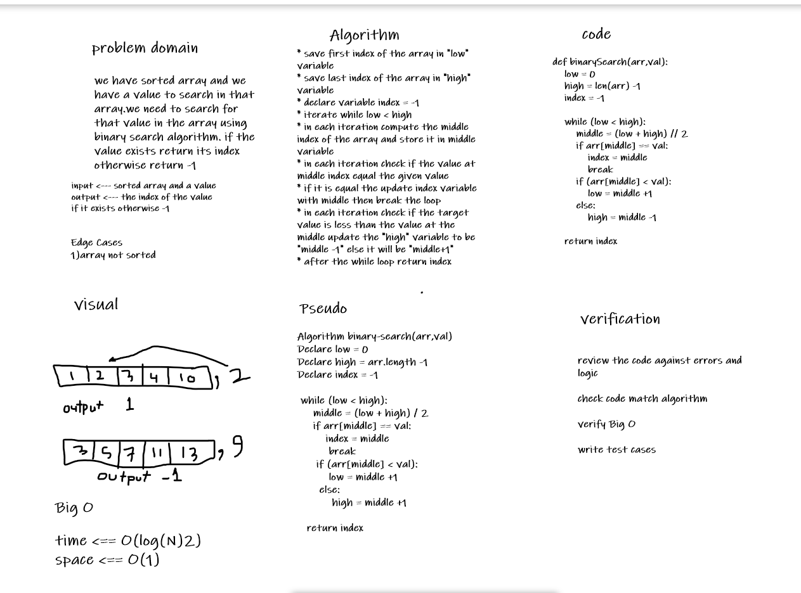

# Binary Search of Sorted Array
we have sorted array and we have a value to search in that array.we need to search for that value in the array using binary search algorithm. if the value exists return its index otherwise return -1

## Whiteboard Process

## Approach & Efficiency

* I chosed two points to start with them , the first point is the first index in the array and the second one is the last index in the array .I refer to them by low and high
* I chosed variable to hold the returned index and I refer to it by index. 
* search for the value  while low is less than high.
* in each iteration compute the middle index and store that index in middle variable.
* in each iteration check if the value at middle equal to give value. if it is then update index with middle value and break the loop.
* in each iteration check if the value at middle is less than the given value. if it is then  update low to be equal middle +1 ,otherwise update high to be equal middle -1.
* at the end of while loop block return index.
* the time complexity for this algorithm is O(log2(N)) becaus in each iteration the algorithm decreases the input to half.
* the space complexity for this algorithm is O(1). I don't use helper list to accomplish the solution.