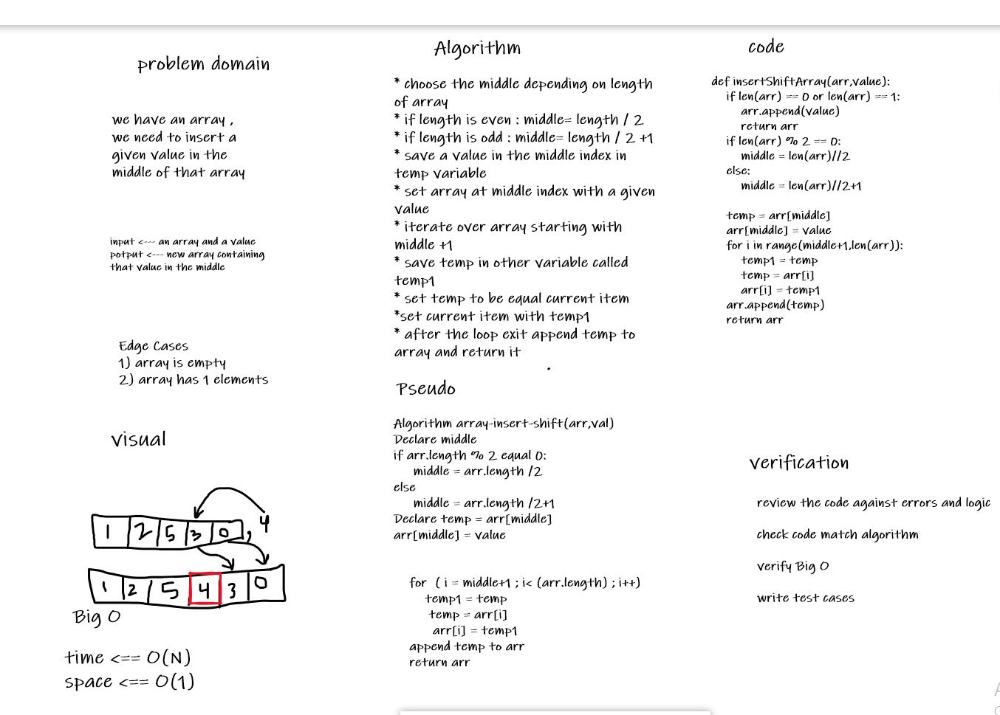

# Insert to Middle of an Array
we have an array , we need to insert a given value in the middle of that array
## Whiteboard Process

## Approach & Efficiency

I chosed to insert the value in the middle of the array without needing another helper array because I dont want to make the space complexty O(N). It stil O(1) but the time complexity is O(N)