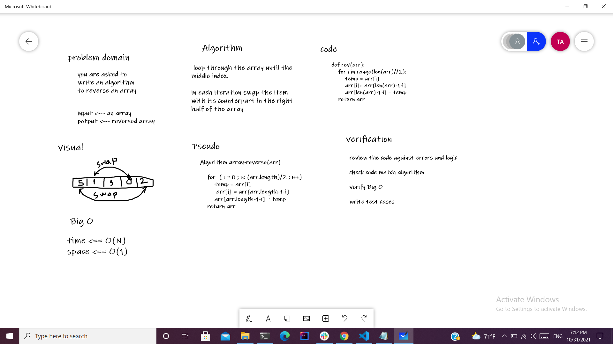

# Reverse an Array
you are asked to write an algorithm to reverse an array.

## Whiteboard Process

## Approach & Efficiency

I looped through the array from zero index to the middle index, then I swapped each item with its counterpart in the right half. The Big O is O(N) for the time and O(1) for space because I reversed the array in place.