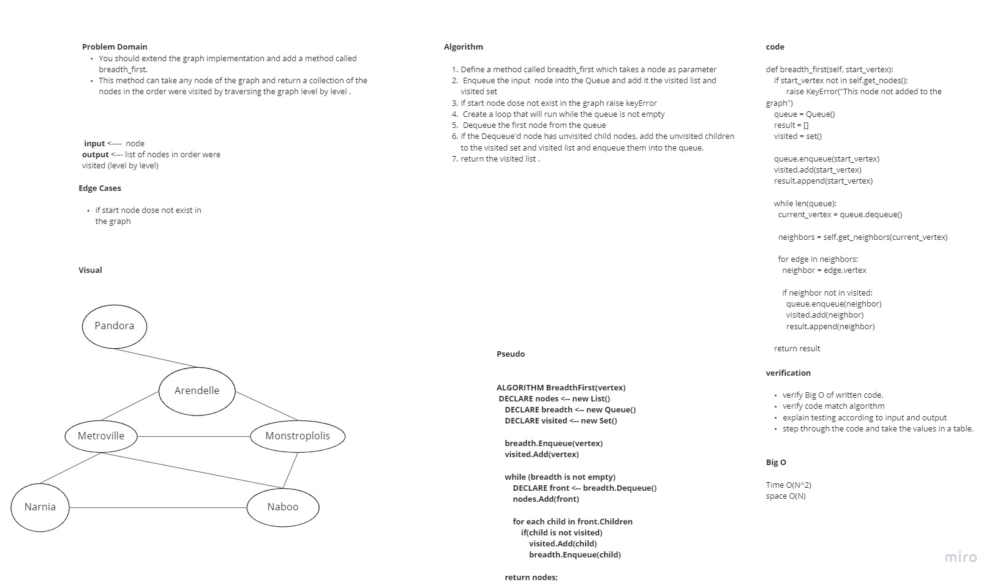
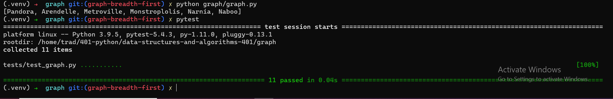

# Challenge Summary
> You should extend the graph implementation and add a method called breadth_first.
This method can take any node of the graph and return a collection of the nodes in the order were visited by traversing the graph level by level .
## Whiteboard Process

## Approach & Efficiency
1. Define a method called breadth_first which takes a node as parameter.
2. Enqueue the input  node into the Queue and add it the visited list and visited set.
3. if start node dose not exist in the graph raise keyError.
4. Create a loop that will run while the queue is not empty.
5. Dequeue the first node from the queue.
6. if the Dequeue'd node has unvisited child nodes, add the unvisited children to the visited set and visited list and enqueue them into the queue.
7. return the visited list .

***Time Complexity*** is O(N^2) because the worst case is when the graph is complete then for each node in the graph we need to check if the neighbors were visited or not

***Space Complexity*** is O(N) because of the needing for queue and set and list

## Solution
