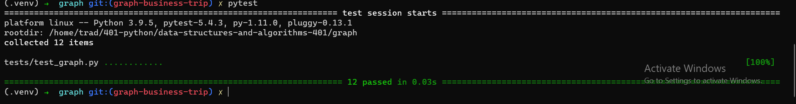

# Challenge Summary
> You should write a function called business trip that takes a graph and array of city names as parameters and return null or cost depending on  whether the trip is possible with direct flights, and how much it would cost.
## Whiteboard Process

## Approach & Efficiency
Algorithm

1. Define a function called bussines trip that takes graph and list of cities as parameteres.
2. declare cost = 0
3. loop over the cities names and for each city retrieve the neighbors
4. if the next city in cities names exists in the neighbors add the weight to the cost and make valid is true
5. after the loop return tuple contains the valid boolean and the cost

***Time Complexity*** is O(N^2) because we loop over the cities names and for each city loop over its neighbors

***Space Complexity*** is O(1) because we did not use any auxiliary data structure

## Solution

