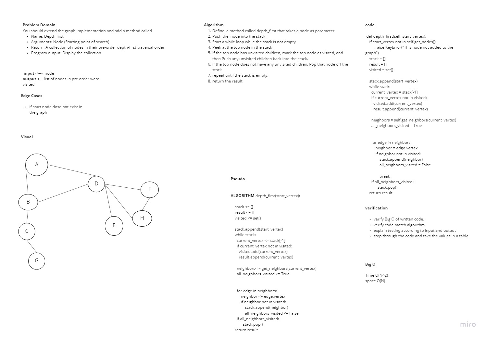

# Depth First Traversal
<!-- Short summary or background information -->

## Challenge
<!-- Description of the challenge -->

## Approach & Efficiency
<!-- What approach did you take? Why? What is the Big O space/time for this approach? -->

## Solution

## Requirements
Ensure your complete solution follows the standard requirements.

1. Write [unit tests](../../Challenge_Testing){:target="_blank"}
1. Follow the [template for a well-formatted README](../../Challenge_Documentation){:target="_blank"}
1. Submit the assignment following [these instructions](../../Challenge_Submission){:target="_blank"}
