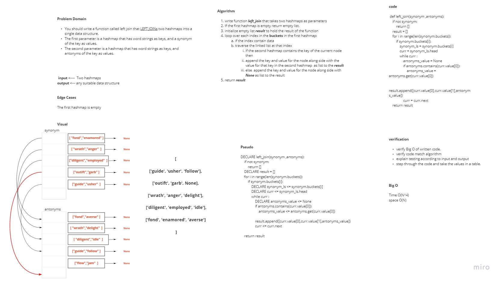

## Challenge
> You should write a function called left join that LEFT JOINs two hashmaps into a single data structure.
The first parameter is a hashmap that has word strings as keys, and a synonym of the key as values.
The second parameter is a hashmap that has word strings as keys, and antonyms of the key as values.

## Whiteboard Process 

## Approach & Efficiency
***Algorithm***

1. write function left_join that takes two hashmaps as parameters
2. If the first hashmap is empty return empty list.
3. initialize empty list result to hold the result of the function
3. loop over each index in the buckets in the first hashmap:
    - if the index contain data
    - traverse the linked list at that index
        - if the second hashmap contains the key of the current node then
        - append the key and value for the node along side with the value for that key in the second hashmap  as list to the result
        - else  append the key and value for the node along side with None as list to the result
5. return result

***Time Complexity*** is O(N^4) because we iterate over each index in the first hashmap and in the worst case it might all the keys may exist in the same index and also to check if the key exist in the second hashmap we need also N in worst case and also to get the value from second hashmap we need N 

***Space Complexity*** is O(N) because we used auxiliary data structure to store the result.

## Solution
