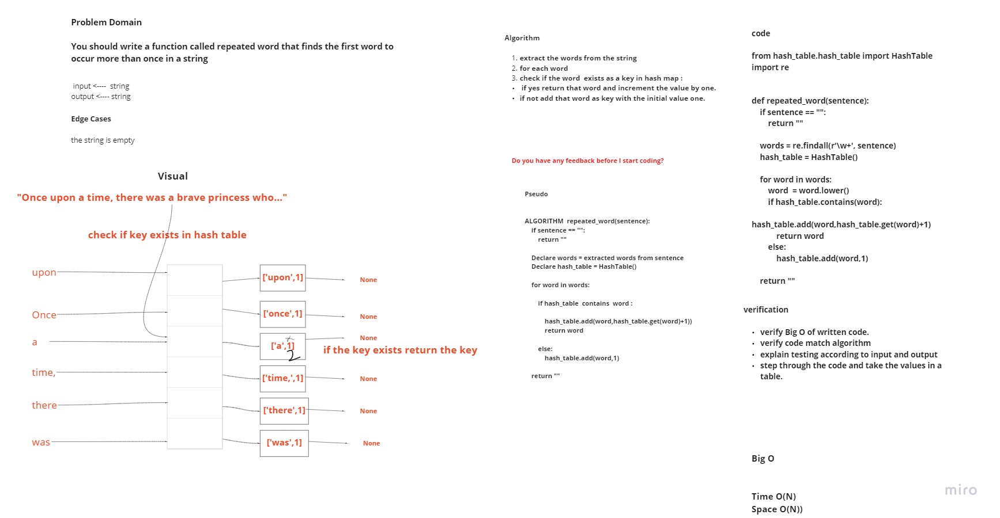
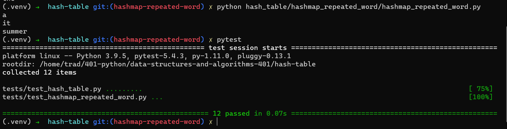

# Challenge Summary
* You should write a function called repeated word that finds the first word to occur more than once in a string
  

## Whiteboard Process

## Approach & Efficiency

***Algorithm***

1. extract the words from the string
2. for each word check if the word  exists as a key in hash map :
   - if yes return that word and increment the value by one.
   - if not add that word as key with the initial value one.

***Time Complexity*** is O(N) because it might the first word to occur more than once in a string exist at the end of the sentence.

***Space Complexity*** is O(N) because of the needing for auxiliary list to extract all the words from the string.

## Solution

