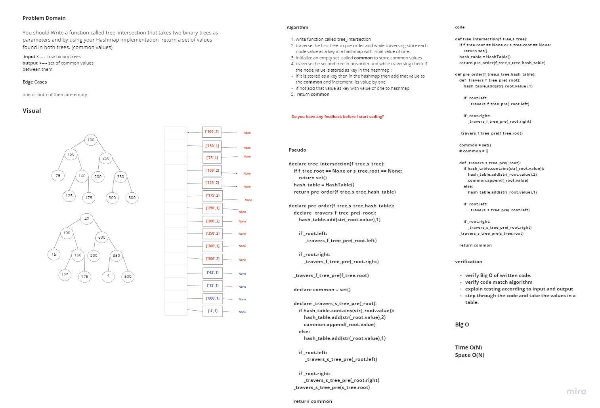
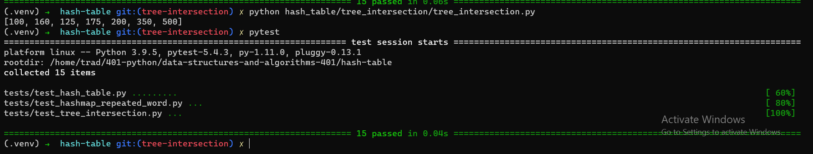

# Challenge Summary

> You should Write a function called tree_intersection that takes two binary trees as parameters and by using your Hashmap implementation  return a set of values found in both trees. (common values)
## Whiteboard Process

## Approach & Efficiency

1. write function called tree_intersection.
2. traverse the first tree  in pre-order and while traversing store each node value as a key in a hashmap with intial value of one.
3. initialize an empty set  called common to store common values.
4. traverse the second tree in pre-order and while traversing check if the node value is stored as key in the hashmap :
   - if it is stored as a key then in the hashmap then add that value to the common and increment  its value by one
   - if not add that value as key with value of one to hashmap
5. return common

***Time Complexity*** is O(N) because we need to traverse each node in the two binary trees.

***Space Complexity*** is O(N) because of the needing for the hashmap data structure.

## Solution

