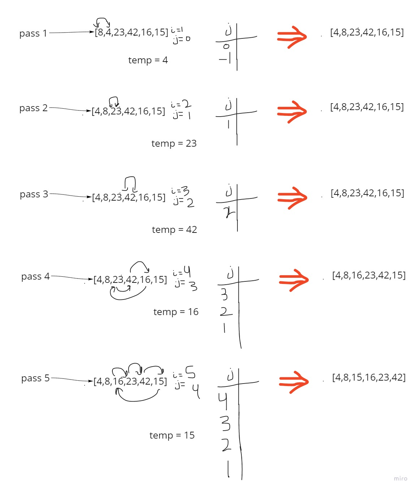

# Insertion Sort
> The Insertion Sort algorithm is an algorithm to sort a given input array or list. The array is virtually split into a sorted and an unsorted part. Values from the unsorted part are picked and placed at the correct position in the sorted part.

### Pseudo code
```python
 InsertionSort(int[] arr)

    FOR i = 1 to arr.length

      int j <-- i - 1
      int temp <-- arr[i]

      WHILE j >= 0 AND temp < arr[j]
        arr[j + 1] <-- arr[j]
        j <-- j - 1

      arr[j + 1] <-- temp
```

### Trace



### Efficency
- Time: O(n^2)
The worst case when the input array is in decending order. This will cause sub-array elements in each iteration to be shifted to the right, So the complexity is O(n^2)
<br>
- Space: O(1)
No additional space is being created. This array is being sorted in place…keeping the space at constant O(1).