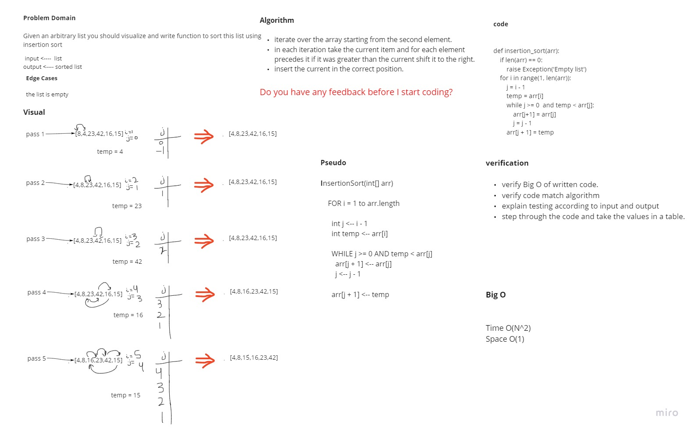

# Challenge Summary
> Given an arbitrary list you should visualize and write function to sort this list using insertion sort

## Whiteboard Process


## Approach & Efficiency
- iterate over the array starting from the second element.
- in each iteration take the current item and for each element precedes it if it was greater than the current shift it to the right.
- insert the current in the correct position.

* Efficency
  - Time: O(n^2)
  The worst case when the input array is in decending order. This will cause sub-array elements in each iteration to be shifted to the right, So the complexity is O(n^2)
  <br>
  - Space: O(1)
  No additional space is being created. This array is being sorted in place…keeping the space at constant O(1).

## Solution
```python
def insertion_sort(arr):
    if len(arr) == 0:
        raise Exception('Empty list')
    for i in range(1, len(arr)):
        j = i - 1
        temp = arr[i]
        while j >= 0  and temp < arr[j]:
            arr[j+1] = arr[j]
            j = j - 1
        arr[j + 1] = temp

if __name__ == "__main__":
    arr1 = [8,4,23,42,16,15]
    print(f"Array before sorting {arr1}")
    insertion_sort(arr1)
    print(f"Array after sorting {arr1}")
```

| Task     | link |
| ----------- | ----------- |
| Insertion Sort | [Insertion Sort](insertion_sort/insertion_sort.py) |
| Test insertion sort | [Test Insertion Sort](tests/test_insertion_sort.py) |
| BLOG | [BLOG](BLOG.md) |