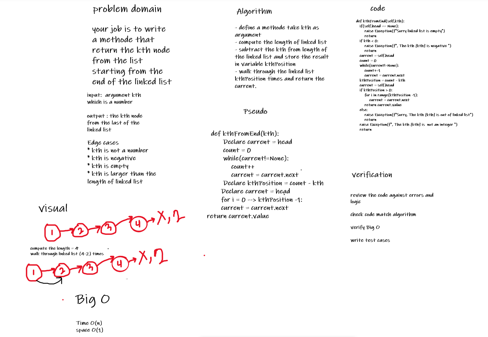
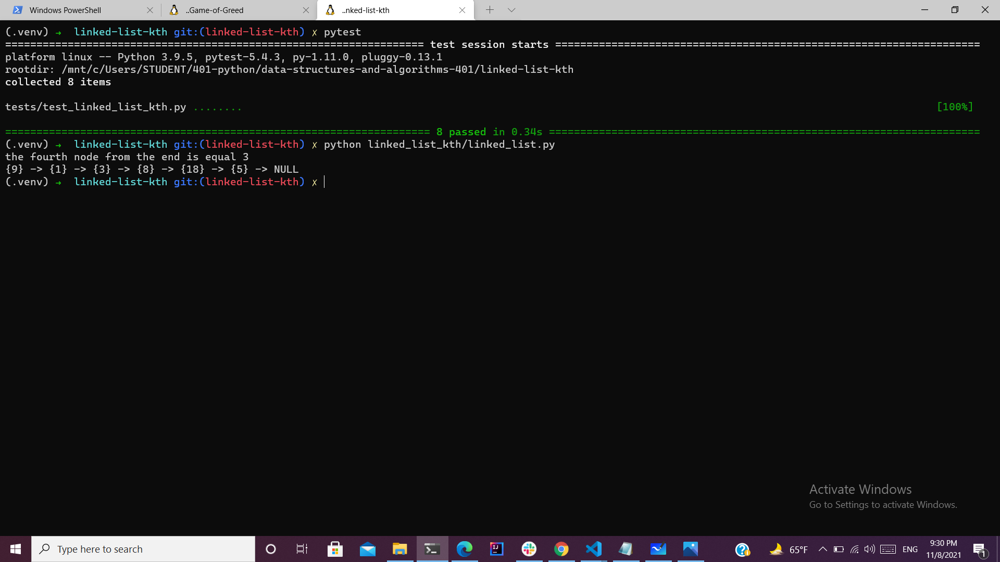

# Challenge Summary

- your job is to write a methode that return the kth node from the list starting from the end of the linked list  


## Whiteboard Process


## Approach & Efficiency
<!-- What approach did you take? Why? What is the Big O space/time for this approach? -->
- I computed the length of the lined list.
- subtract the kth from length and store the result in kthPosition.
- move on linked list kthPosition times.
- at the last iteration return the node value.
- Time O(n)
- space O(1)

## Solution
<!-- Show how to run your code, and examples of it in action -->



````python
def test_kth_in_the_middle():
    ll = LinkedList()
    ll.insert(10)
    ll.insert(5)
    ll.insert(3)
    ll.insert(7)
    ll.insert(9)
    assert 3 == ll.kthFromEnd(2)
```


