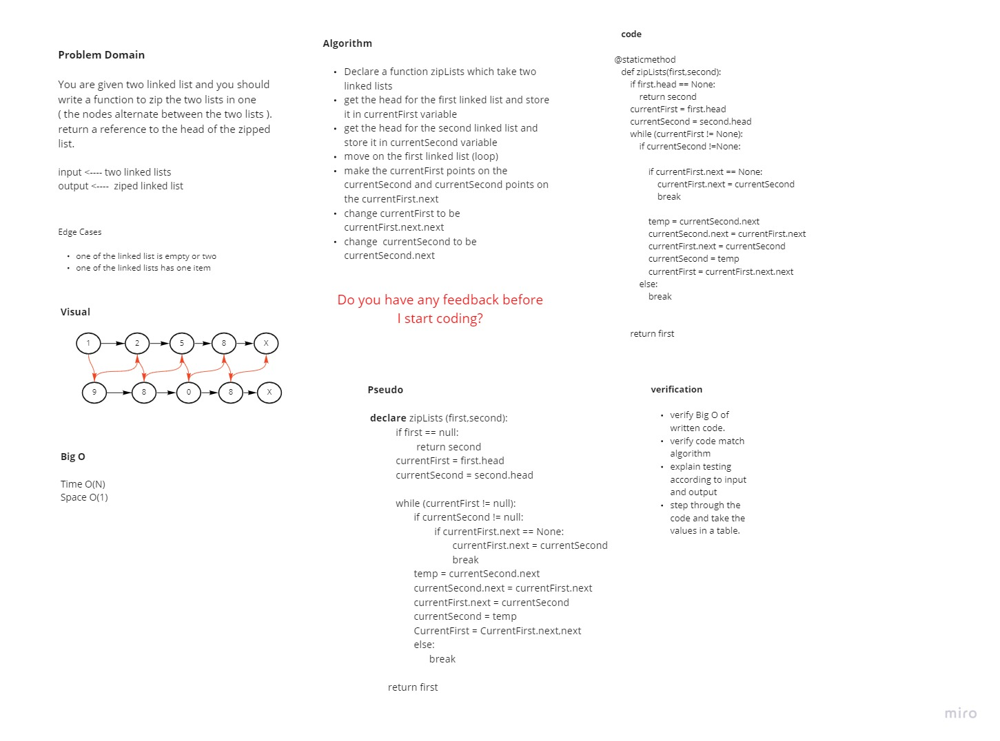

# Challenge Summary

- You are given two linked list and you should write a function to zip the two lists in one
( the nodes alternate between the two lists ). return a reference to the head of the zipped list.


## Whiteboard Process


## Approach & Efficiency
<!-- What approach did you take? Why? What is the Big O space/time for this approach? -->
- save first linked list node (head) in currentFirst
-  save second linked list node (head) in currentSecond
- move on the first linked list (loop)
- make the currentFirst points on the currentSecond and currentSecond points on the currentFirst.next
- update currentFirst to be equal currentFirst.next.next
- update  currentSecond to be equal  currentSecond.next

- Time O(N)
- Space O(1)
  
## Solution
<!-- Show how to run your code, and examples of it in action -->


```python
def test_zip_two_linked_lists_are_equal_in_length():
    first = LinkedList()
    first.append(1)
    first.append(3)
    first.append(2)
    first.append(10)
    second = LinkedList()
    second.append(5)
    second.append(9)
    second.append(4)
    second.append(2)

    expected = "{1} -> {5} -> {3} -> {9} -> {2} -> {4} -> {10} -> {2} -> NULL"
    actual = LinkedList.zipLists(first, second).__str__()
    assert actual == expected

```


