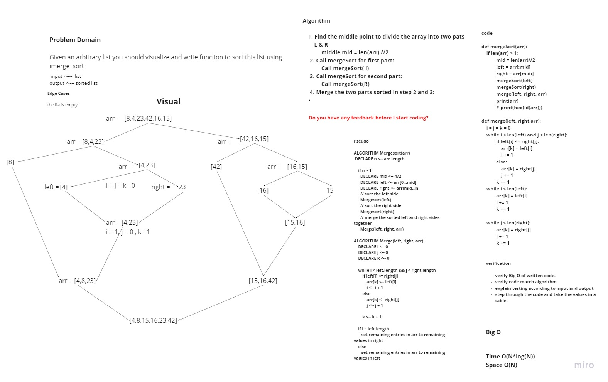

# Challenge Summary
> Given an arbitrary list you should visualize and write function to sort this list using imerge  sort

## Whiteboard Process


## Approach & Efficiency
* Algorithm
    1. Find the middle point to divide the array into two pats L & R
            middle mid = len(arr) //2
    2. Call mergeSort for first part:   
                 Call mergeSort( l)
    3. Call mergeSort for second part:
                 Call mergeSort(R)
    4. Merge the two parts sorted in step 2 and 3

> Time Complexity : O(N*log(N)) because we divide the array in each recursion call into two parts and in each call we need n comarision so N*log(N)
<br>
Space Complexity : O(N) Because we need Auxiliary arrays in each recursion call
   
## Solution

```python
def mergeSort(arr):
	if len(arr) > 1:
            mid = len(arr)//2
            left = arr[:mid]
            right = arr[mid:]
            mergeSort(left)
            mergeSort(right)
            merge(left, right, arr)
            print(arr)
            # print(hex(id(arr)))

def merge(left, right,arr):
    i = j = k = 0
    while i < len(left) and j < len(right):
            if left[i] <= right[j]:
                arr[k] = left[i]
                i += 1
            else:
                arr[k] = right[j]
                j += 1
            k += 1
    while i < len(left):
            arr[k] = left[i]
            i += 1
            k += 1

    while j < len(right):
            arr[k] = right[j]
            j += 1
            k += 1


if __name__ == '__main__':
	arr = [8,4,23,42,16,15]
	print(f"Array before sorted is {arr}")
	mergeSort(arr)
	print(f"Array after sorted is {arr}")


```

| Task     | link |
| ----------- | ----------- |
| Merge Sort | [Merge Sort](merge_sort/merge_sort.py) |
| Test Merge sort | [Test Merge Sort](tests/test_merge_sort.py) |
| BLOG | [BLOG](BLOG.md) |