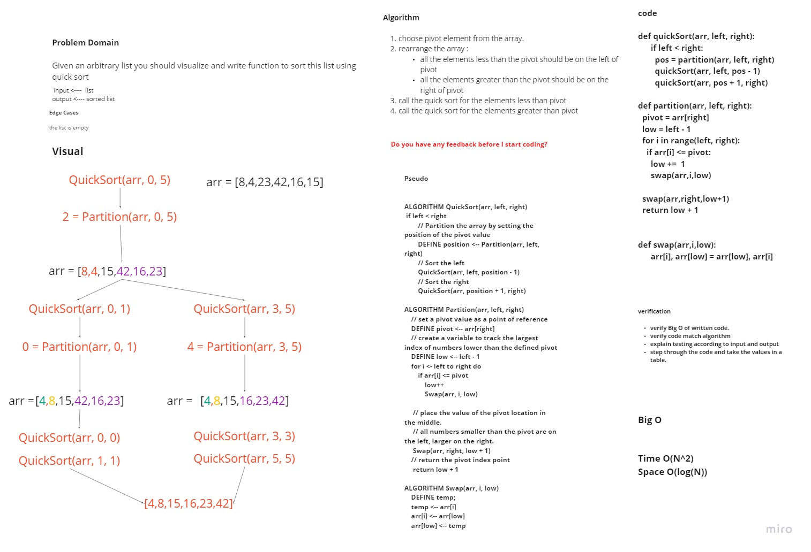

# Challenge Summary
> Given an arbitrary list you should visualize and write function to sort this list using quick sort

## Whiteboard Process


## Approach & Efficiency
* Algorithm
1. choose pivot element from the array.
2. rearrange the array :
   - all the elements less than the pivot should be on the left of pivot
   - all the elements greater than the pivot should be on the right of pivot
3. call the quick sort for the elements less than pivot
4. call the quick sort for the elements greater than pivot

>  Time Complexity : O(n2) It occurs when the pivot element picked is either the greatest or the smallest element.
<br>
Space Complexity : O(log(N)) Because quick sort calls itself log(n) times.
   
## Solution

```python
def quickSort(arr, left, right):
      if left < right:
        pos = partition(arr, left, right)
        quickSort(arr, left, pos - 1)
        quickSort(arr, pos + 1, right)

def partition(arr, left, right):
  pivot = arr[right]
  low = left - 1
  for i in range(left, right):
    if arr[i] <= pivot:
      low +=  1
      swap(arr,i,low)

  swap(arr,right,low+1)
  return low + 1


def swap(arr,i,low):
      arr[i], arr[low] = arr[low], arr[i]
      

if __name__ == "__main__":
    arr = [8,4,23,42,16,15]
    print(f"Array before sorted is {arr}")
    quickSort(arr,0,len(arr)-1)
    print(f"Array after sorted is {arr}")


```

| Task     | link |
| ----------- | ----------- |
| Quick Sort | [Quick Sort](quick_sort/quick_sort.py) |
| Test Quick sort | [Test Quick Sort](tests/test_quick_sort.py) |
| BLOG | [BLOG](BLOG.md) |