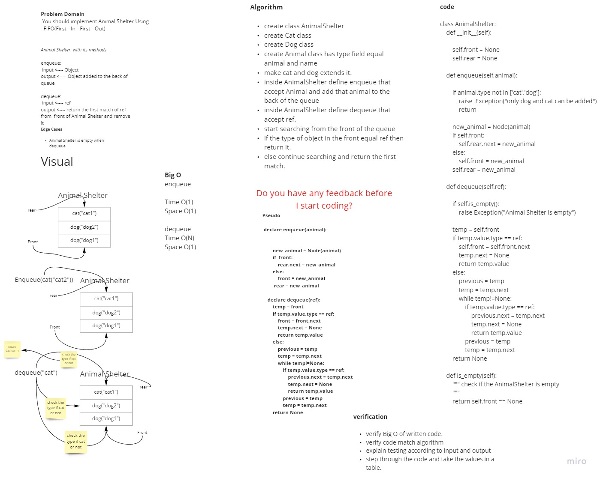
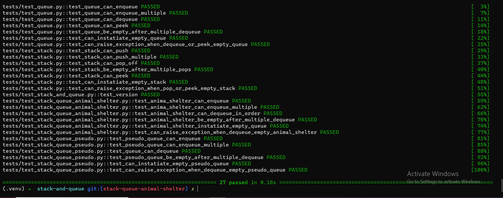

# Challenge Summary
<!-- Description of the challenge -->

 You should implement Animal Shelter Using  FIFO (First - In - First - Out)

## Whiteboard Process
<!-- Embedded whiteboard image -->

## Approach & Efficiency
<!-- What approach did you take? Why? What is the Big O space/time for this approach? -->

Algorithm

- create class AnimalShelter
- create Cat class
- create Dog class
- create Animal class has type field equal animal and name
- make cat and dog extends it.
- inside AnimalShelter define enqueue that accept Animal and add that animal to the back of the queue
- inside AnimalShelter define dequeue that accept ref.
- start searching from the front of the queue
- if the type of object in the front equal ref then return it.
- else continue searching and return the first match.

- enqueue
> Time O(1)
> Space O(1)

- dequeue
> Time O(N)
> Space O(1)

## Solution
<!-- Show how to run your code, and examples of it in action -->

