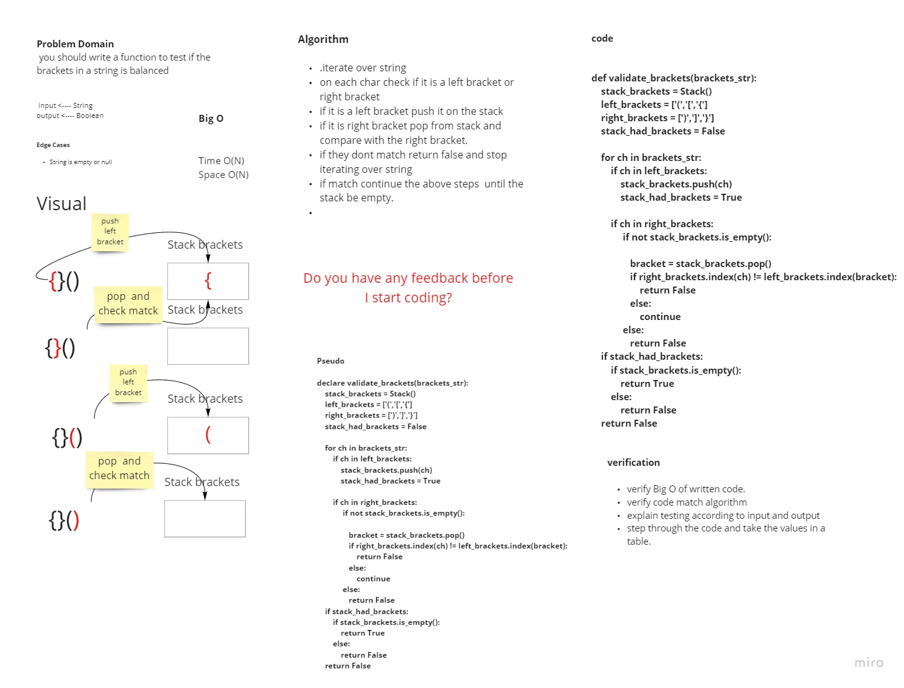
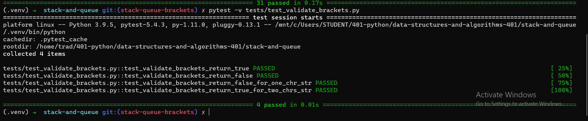

# Challenge Summary
<!-- Description of the challenge -->

 you should write a function to test if the brackets in a string is balanced

## Whiteboard Process
<!-- Embedded whiteboard image -->

## Approach & Efficiency
<!-- What approach did you take? Why? What is the Big O space/time for this approach? -->

Algorithm

- iterate over string
- on each char check if it is a left bracket or right bracket
- if it is a left bracket push it on the stack
- if it is right bracket pop from stack and compare with the right bracket.
- if they dont match return false and stop iterating over string
- if match continue the above steps  until the stack be empty.

Complexity
> Time O(N)
> Space O(N)

## Solution
<!-- Show how to run your code, and examples of it in action -->

