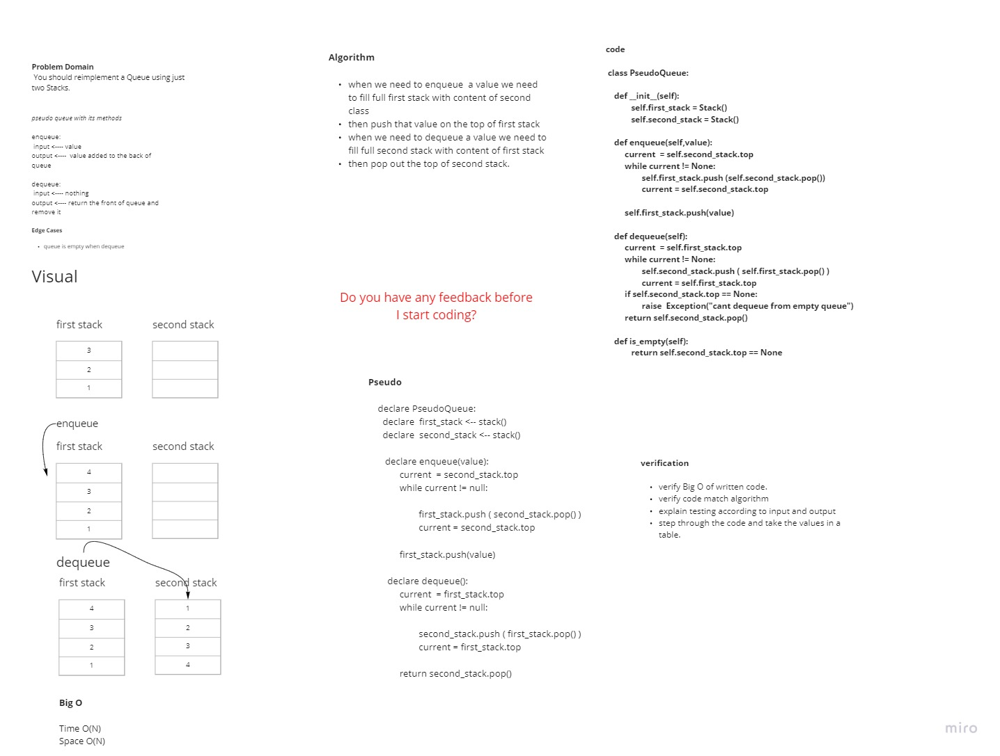
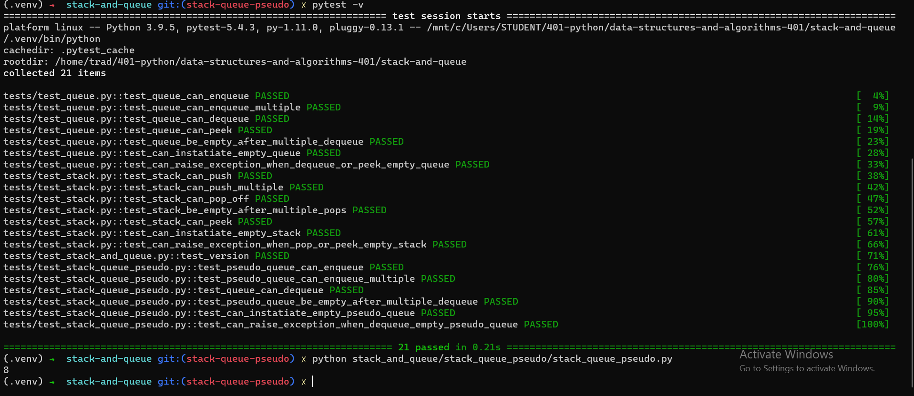

# Challenge Summary
<!-- Description of the challenge -->

Implementaion Queue structure in a new way. In this way we shoul implement the Queue using only two stacks.

## Whiteboard Process
<!-- Embedded whiteboard image -->

## Approach & Efficiency
<!-- What approach did you take? Why? What is the Big O space/time for this approach? -->

1. I used two stack one for doing enqueue and the second for dequeue.
2. if you want to enqueue you should first empty the contents of the second stack in the first stack and then push the value on the top of the first stack.
3. if you want to dequeue you should empty the contents of the first stack in the second stack and then pop from the second stack.

> Time O(N)
> Space O(N)

## Solution
<!-- Show how to run your code, and examples of it in action -->

