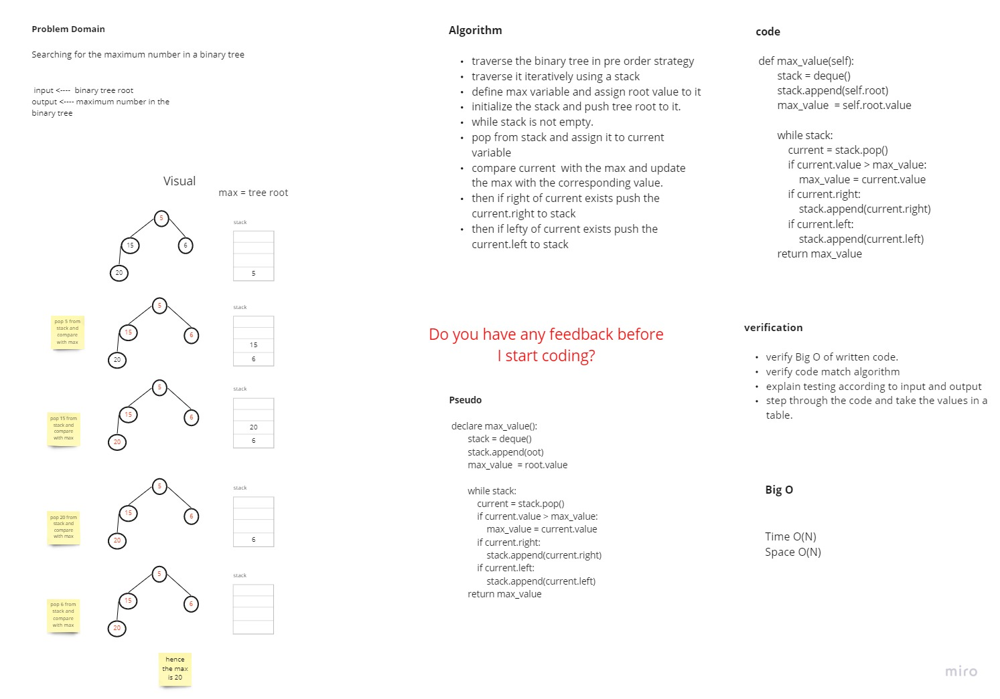
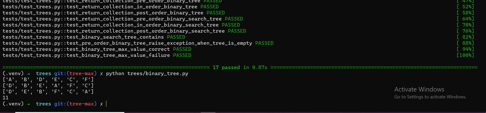

# Challenge Summary
<!-- Description of the challenge -->

* Searching for the maximum number in a binary tree

## Whiteboard Process
<!-- Embedded whiteboard image -->

## Approach & Efficiency
<!-- What approach did you take? Why? What is the Big O space/time for this approach? -->
> traverse the binary tree in pre order strategy
traverse it iteratively using a stack
define max variable and assign root value to it
initialize the stack and push tree root to it.
while stack is not empty.
pop from stack and assign it to current variable
compare current  with the max and update the max with the corresponding value.
then if right of current exists push the current.right to stack
then if lefty of current exists push the current.left to stack

Time Big O(N)
Space Big O(N)

## Solution
<!-- Show how to run your code, and examples of it in action -->

