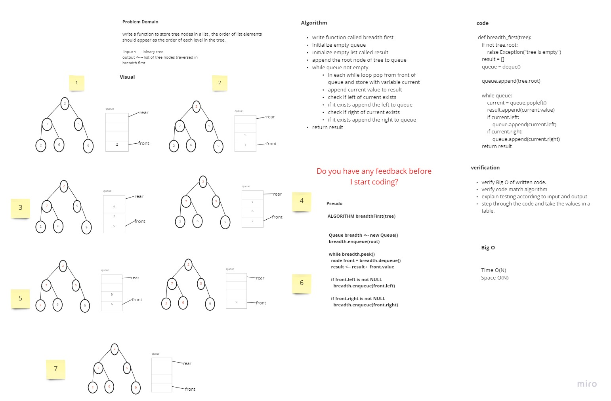
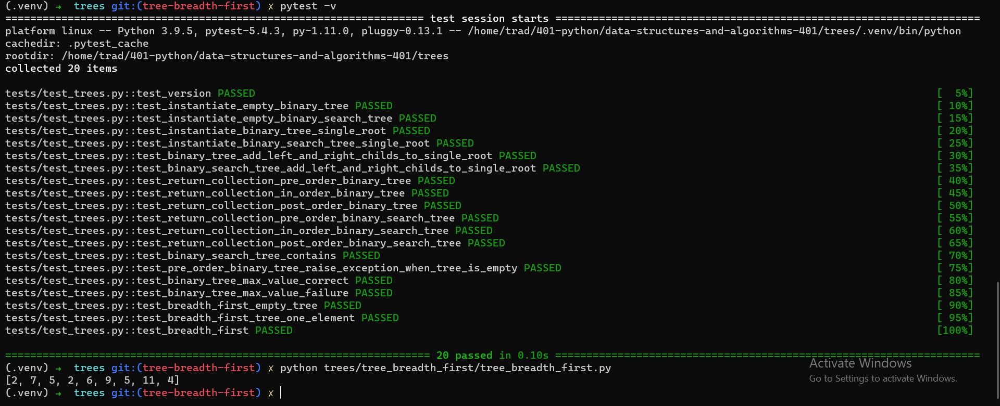

# Challenge Summary
<!-- Description of the challenge -->

* write a function to store tree nodes in a list , the order of list elements should appear as the order of each level in the tree.(breadth first traverse)

## Whiteboard Process
<!-- Embedded whiteboard image -->

## Approach & Efficiency
<!-- What approach did you take? Why? What is the Big O space/time for this approach? -->
> write function called breadth first
initialize empty queue
initialize empty list called result
append the root node of tree to queue
while queue not empty
in each while loop pop from front of queue and store with variable current
append current value to result
check if left of current exists
if it exists append the left to queue
check if right of current exists
if it exists append the right to queue
return result

Time Big O(N)
Space Big O(N)

## Solution
<!-- Show how to run your code, and examples of it in action -->

