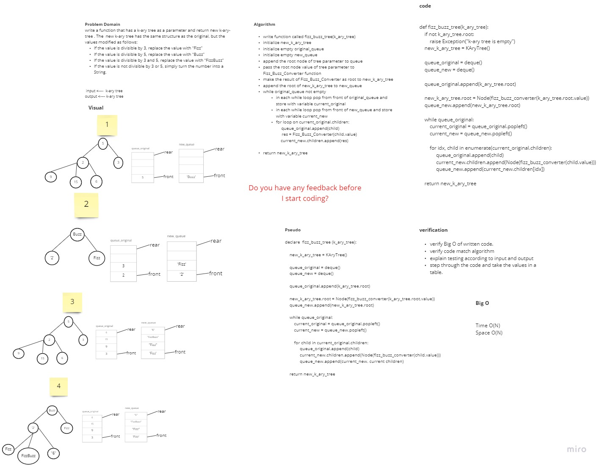
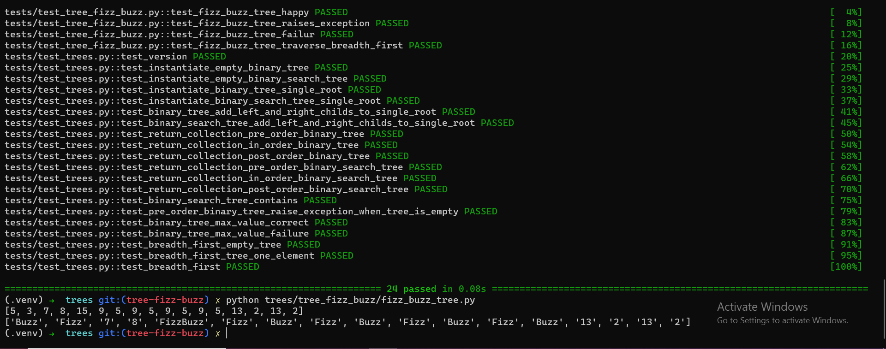

# Challenge Summary
<!-- Description of the challenge -->

* write a function that has a k-ary tree as a parameter and return new k-ary-tree . The  new k-ary tree has the same structure as the original, but the values modified as follows:
If the value is divisible by 3, replace the value with “Fizz”
If the value is divisible by 5, replace the value with “Buzz”
If the value is divisible by 3 and 5, replace the value with “FizzBuzz”
If the value is not divisible by 3 or 5, simply turn the number into a String.

## Whiteboard Process
<!-- Embedded whiteboard image -->

## Approach & Efficiency
<!-- What approach did you take? Why? What is the Big O space/time for this approach? -->
> write function called fizz_buzz_tree(k_ary_tree)
initialize new_k_ary_tree
initialize empty original_queue
initialize empty new_queue
append the root node of tree parameter to queue
pass the root node value of tree parameter to Fizz_Buzz_Converter function
make the result of Fizz_Buzz_Converter as root to new_k_ary_tree
append the root of new_k_ary_tree to new_queue
while original_queue not empty
in each while loop pop from front of original_queue and store with variable current_original
in each while loop pop from front of new_queue and store with variable current_new
for loop on current_original.children:
                queue_original.append(child)
                         res = Fizz_Buzz_Converter(child.value)
       current_new.children.append(res)
return new_k_ary_tree

Time Big O(N)
Space Big O(N)

## Solution
<!-- Show how to run your code, and examples of it in action -->

